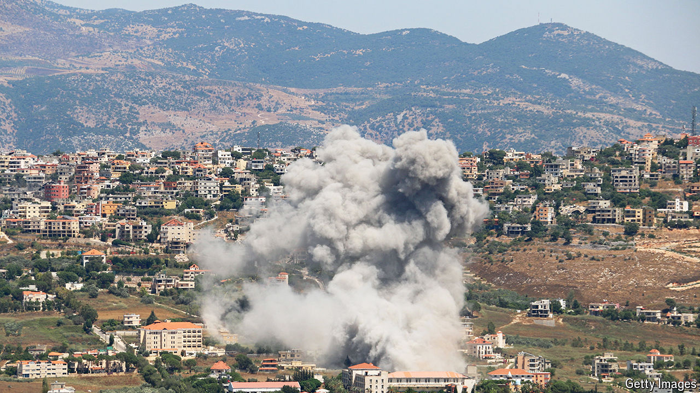

###### The northern front

# Hizbullah poses a grave threat to Israel 

##### But a war right now would be disastrous 

 

> Jul 4th 2024 

As the INTENSITY of the fighting in Gaza ebbs, an even more dangerous conflagration looms on Israel’s northern border. Ever since the day after  on October 7th, Hizbullah, another Iran-backed militia, based in Lebanon, has battered northern Israel with rocket and drone strikes. Fires have burned thousands of acres of land and 70,000 evacuated Israelis have been unable to return to their homes. The Israel Defence Forces (idf) have hit back, driving 90,000 Lebanese from the south of the country. On July 3rd they assassinated a prominent Hizbullah leader. An  could be one of the biggest conflicts in the region for decades. Israel has no good answer to Hizbullah’s menace. That means it should seek to avoid a war today and instead focus on rebuilding deterrence. 

The threat from Hizbullah is not new, but it is more serious than it was. By making parts of the north uninhabitable, the militia has put Israel in an impossible position. Understandably, Israelis are outraged by the presence of an enemy on its borders that envisions Hamas-style attacks. Israel’s invasion of Lebanon in 2006, aimed at pushing Hizbullah from the border, led to a bloody 34-day war that did, from an Israeli point of view, weaken the militia. Now some officials are calling for another invasion, warning that Gaza will look like a “paradise” compared with Lebanon once it ends. 

