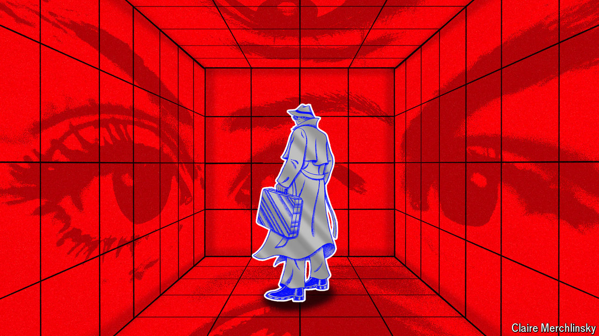

###### Cloud and dagger

# How spies should use technology 

##### Digital tools are transforming spycraft, but won’t replace human agents 

 

> Jul 4th 2024 

Philo of Byzantium, an inventor of the third century BC, described how crushed gallnuts, dissolved in water, could make invisible ink. Technology has shaped  for millennia, but today it is having an unprecedented effect. The internet enables covert action on a grand scale. Biometric border controls impede spies operating abroad. Smartphones haemorrhage secrets.

Some conclude that intelligence services in their current form are obsolete. Why steal secrets when open and commercial sources such as satellite imagery and phone-location data can expose mischief? Who needs human spooks when it is so hard to protect their identities and so easy to snoop digitally?

