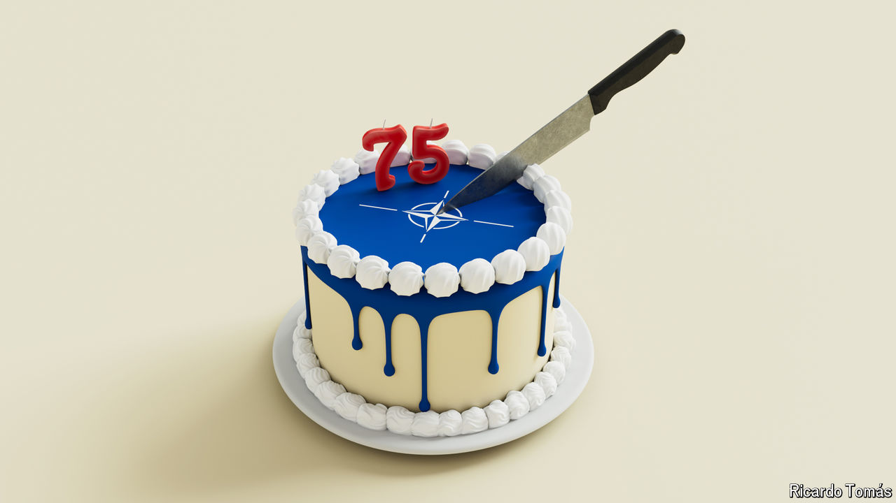

###### NATO at 75

# How to Trump-proof America’s alliances 

##### An essential step will be to let Ukraine into NATO 

 

> Jul 4th 2024 

Nato’s leaders gather in Washington on July 9th-11th to celebrate “the greatest military alliance in the history of the world”, as President Joe Biden calls it. He is right. NATO has helped keep the peace in Europe for 75 years, a stunning achievement after the continent’s centuries of war. Its “Article 5” guarantee—that an attack on one member is an attack on all—has deterred first the Soviet Union and then Russia. NATO has also been a forum for resolving tensions between its members. Small wonder nervous nations clamour to become part of it. Membership has risen from 12 in 1949 to 32 now, with Sweden joining in April and Finland last year.

Yet, although NATO has much to celebrate, this will not be a happy anniversary. Russia’s invasion of Ukraine grinds on. China continues to support Russian industry. Iran and North Korea are supplying Vladimir Putin with drones, ballistic missiles and artillery shells. The autocratic governments of these four countries are growing ever closer, a challenge to the world order that NATO has done so much to underpin. 

