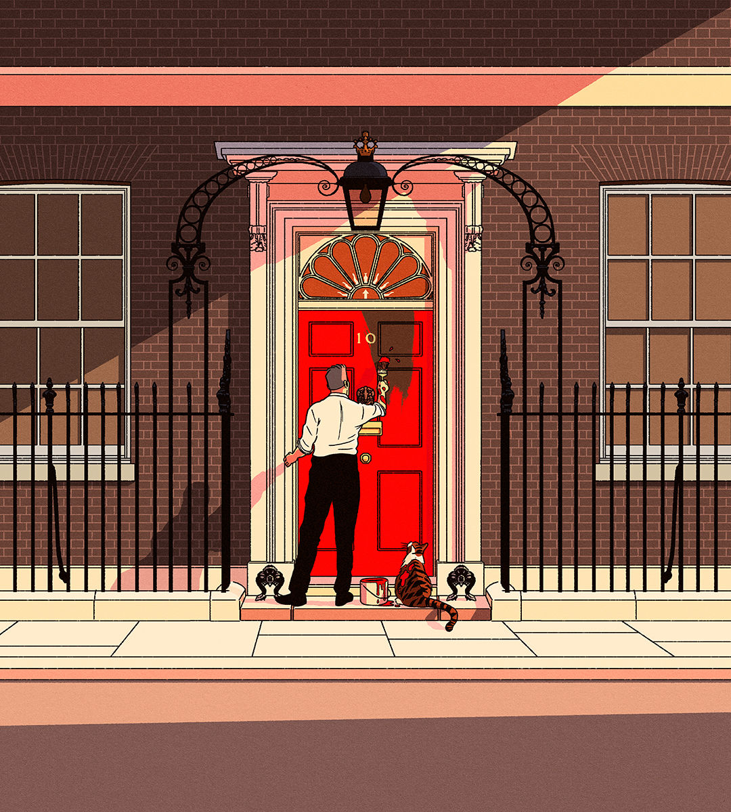

###### Keir not

# Labour has won the British election. Now it has to seize the moment 

##### A volatile electorate and a strong showing for Reform UK are no reason for caution 

 

> Jul 5th 2024 

When something is anticipated, it can be easy to miss its significance. The Labour Party’s  in the British general election on July 4th was expected, but it is nonetheless momentous. In 2019 Labour limped to its worst result in almost a century; Boris Johnson won a victory that was meant to keep him in power for a decade. Under the leadership of , Labour has swept to power, with a projected majority of at least 170, just shy of the one Sir Tony Blair achieved in 1997. The Conservatives have deservedly been battered: their expected tally of 122 seats is worse than any in their modern history. 

This change of management is a good result for Britain. Out goes a Tory government that had turned chaos into an art form. In comes a party that has focused ruthlessly on improving its electoral appeal. A country that was one of the first in the West to succumb to populist radicalism, by voting for Brexit in 2016, has opted decisively for a serious-minded centrist who pledges stability. North of the border, too, a collapse in the vote for the Scottish National Party marks a welcome turn away from the ideological pursuit of independence and towards a more pragmatic form of government.


If anyone concludes that Britain is back to normal, however, they should think again. The electorate has become extraordinarily volatile. This has been one of the biggest swings in a single Parliament; the very idea of safe seats is increasingly questionable. Voters are disenchanted with establishment politicians. According to the latest British Social Attitudes Survey, a record high of 45% “almost never” trust governments to put the nation’s interests first, up from 34% in 2019. 

This lack of faith is most obvious in the performance of , an upstart anti-immigration party led by Nigel Farage that took great chunks out of the Tory support, even if it converted those votes into only a handful of seats. It is also visible in the strong performance of independent candidates protesting against what they saw as Labour’s equivocation in condemning the war in Gaza, and in the comparative lack of enthusiasm for Sir Keir himself, who will enter office with a negative approval rating. Voters have handed an enormous win to a party that appears to arouse little excitement. It is a resounding stamp of approval that manages to feel like a shrug. 

The danger is that Sir Keir concludes he should be cautious precisely when he should be bold. During the campaign, fear of losing the election led the party to adopt a “Ming vase” strategy of avoiding controversy and closing down possible lines of attack. The case for circumspection will now be heard again. Reform UK came second to Labour in many constituencies and has vowed to win over its working-class voters. That, some will say, argues for being more draconian on immigration, going slowly on decarbonisation and doing more to protect domestic jobs. Yes, Labour has a huge majority, but it could evaporate. Drop the vase in government and Labour will be a one-term wonder.

Such arguments are flat-out wrong. Labour’s stated priority is the right one: . Boosting economic growth requires a government that is willing to break things. It is true that Labour’s victory owes more to the unpopularity of the Tories than to a wave of acclamation for Sir Keir. But a government that owes its thwacking majority to the incompetence of its opponents is still a government with a thwacking majority. In the British system that gives Labour a lot of power to get things done. 

The party could spend the next five years looking over its shoulder at Reform UK and the Tories. But the nature of its new parliamentary intake and its electoral coalition enable Labour to ignore the peculiar preoccupations that have disfigured British politics in recent years. The government has no caucus of rabid Brexiteers to satisfy. No backbench group of Nimby MPs will work to suffocate growth-enhancing development. No one will bang on about Rwanda and the European Court of Human Rights. Whereas Tory supporters say immigration is their top priority, the Labour electorate places it fifth. 

All of which presents Sir Keir with a huge opportunity to maximise growth, if only Labour can muster sufficient political imagination. The new government could complete HS2, a truncated high-speed railway line, to show that it is serious about getting stuff built. It could overhaul Britain’s discretionary planning system and give local governments 100% of the business rates on big new infrastructure projects to give them a reason to build. It could pilot road-pricing schemes. It could abolish fees for high-skilled immigrants. It could stop running scared on Europe and lay out a path to structurally deeper co-operation with Britain’s biggest trading partner. 

Creativity is also needed to make the state work better. The Tories may have been , but the problems that beset the British state pre-date them. Efforts to break down silos between Whitehall departments are needed to tackle complex problems like economic inactivity. Labour should improve the flow of data to policymakers, devolve fiscal powers to regional conurbations and focus the Treasury on growth. It could use ministerial powers to get prisons built and use short custodial sentences to ease needless pressures on the judicial system. Reforms of this kind may not rouse the electorate to a fever pitch, but a man of Sir Keir’s technocratic persistence is ideally suited to seeing them through. 

With a huge majority, continued discipline and a mandate to pursue growth, all these things are possible. If Sir Keir can improve Britain’s chronic low productivity and raise the efficiency of the British state, then he may offer a lesson to centrists elsewhere: not just how to win power, but how to use it. It starts by him seizing the moment. ■

