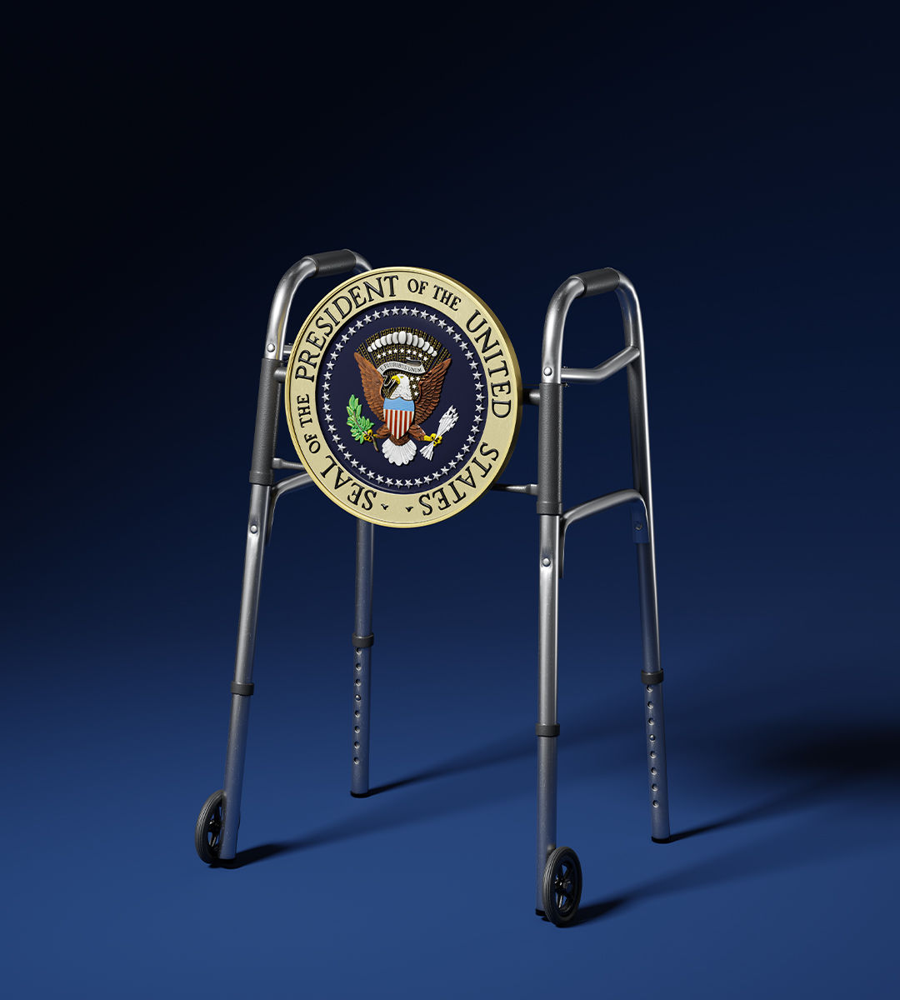

###### American politics

# Why Biden must withdraw 

##### The president and his party portray themselves as the saviours of democracy. Their actions say otherwise 

 

> Jul 4th 2024 

THE PRESIDENTIAL  was awful for Joe Biden, but the cover-up has been worse. It was agony to watch a befuddled old man struggling to recall words and facts. His inability to land an argument against a weak opponent was dispiriting. But the operation by his campaign to deny what tens of millions of Americans saw with their own eyes is more toxic than either, because its dishonesty provokes contempt.

The effect has been to put the White House within Donald Trump’s grasp. Fresh polls have found that voters in the states Mr Biden must win have moved against him. His lead may be in danger even in once-safe states such as Virginia, Minnesota and New Mexico.

