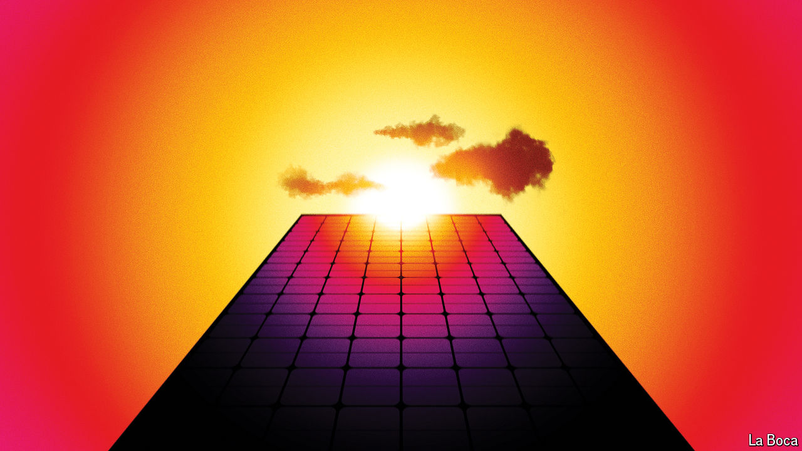

###### On solar power, the New York Times bestseller list, Metallica, football, presidential debates

# Letters to the editor 

##### A selection of correspondence 

 

> Jul 4th 2024 

Let solar shine

To realise the potential of solar power the world must take urgent, co-ordinated action to achieve universal energy access with renewables (“”, June 22nd). If we don’t 660m people, most of them in developing and emerging economies, will be still living without electricity at the end of this decade. 

