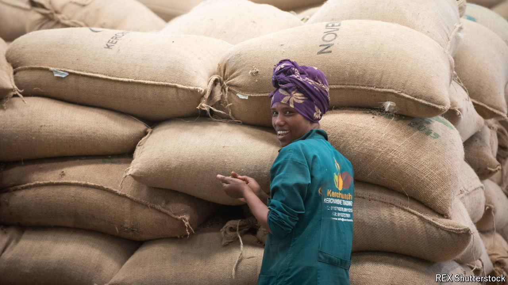

###### The forest for the trees

# How EU do-goodery risks harming Africa’s small farmers 

##### New forest-mapping rules may shut African crops out of European markets 

 

> Jul 4th 2024 

Sacks of coffee are piled high in an Ethiopian warehouse, dwarfing the workers who scurry between them. “Our farmers’ lives are dependent on this coffee,” says Dejene Dadi Dika, the general manager of the Oromia Coffee Farmers Co-operative Union, which has more than half a million member farms. He is worried about a new EU deforestation regulation, which requires that every bean sold in Europe be traced to the field it came from. It costs the co-op about $4 to geo-locate each farm, and he wonders who will pay. 

With the stroke of a pen, the EU is rewriting trading practices the world over. It wants firms bringing cocoa, coffee, rubber, soya, palm oil, wood or cattle products into Europe to prove that those commodities did not come from land which was deforested after 2020. An importer breaking the rules can be fined up to 4% of its turnover in the EU. Millions of small farms will need to be geo-located and supply chains redesigned. It is a race against time before the rule kicks in at the end of this year.

