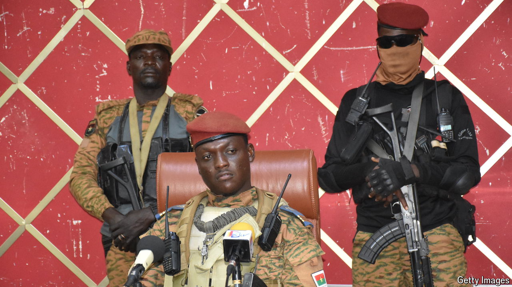

###### The new nationalists

# Meet the victors in Africa’s coup belt 

##### They are militaristic, nationalistic and keen to cut a deal 

 

> Jul 2nd 2024 

The West’s relations with  seemed to have hit rock bottom in May when Niger ordered America to withdraw its forces by September—having already booted out a French counter-terrorism mission—and welcomed Russian military advisers. Then even this bottom fell out. Last month Niger, which supplies about a quarter of Europe’s uranium, revoked the mining licence of France’s state-owned nuclear-fuel company. Many fear the country will now hand over the rights to one of the world’s biggest uranium mines to a state-owned Russian firm.

 turn against the West comes amid what many in French-speaking west Africa are calling a second “independence”. It is being spurred by a new generation of nationalists who have taken power in former French colonies from  to Chad and the three core countries of the Sahel: Burkina Faso, Mali and Niger. They have done so amid strident appeals to sovereignty and autonomy, in language reminiscent of Ahmed Sekou Touré, independent Guinea’s first president, who told Charles de Gaulle in 1958: “Guinea prefers poverty in liberty to riches in slavery”. Several have strengthened ties with Russia. All want a new relationship with the West. “‘Sovereignty’ is the big word in the region these days,” says Ibrahim Yahaya of Crisis Group, a Brussels-based think-tank. “It has become almost like a religious dogma.” 

