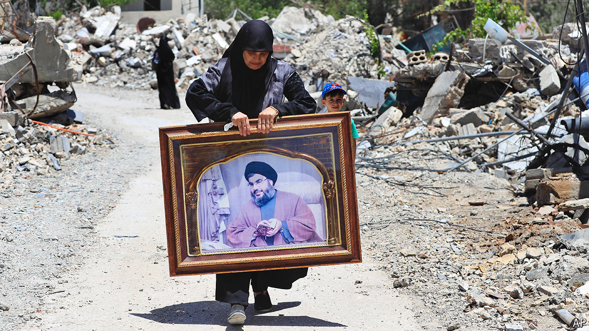

###### The northern front

# The next terrifying war: Israel v Hizbullah 

##### It would feature kamikaze drones, mass blackouts and the largest missile barrage in history 

 

> Jul 2nd 2024 

A war is looming in . For months Israel and , an Iranian-armed Shia militia, have traded drones, rockets and missiles (see charts).  has been blasted and depopulated: 70,000 people have been displaced. More have left southern Lebanon. On July 3rd Israel killed a senior Hizbullah commander; the group responded with a heavy rocket barrage. Several countries, including America, are telling their citizens to leave Lebanon. Israel’s leaders talk of war as though it is inevitable. It would be the most intense conflict in the region in decades—a calamity for Israel and a disaster for Lebanon.

There are still ways out. American and European diplomats continue to shuttle between Israel and Lebanon, hoping, with less and less optimism, to get Hizbullah to withdraw 7-10km away from the border. On July 2nd the group said it would stop firing if there was a truce in Gaza. Even then, the result would be a tenuous peace, with the threat of cross-border raids by Hizbullah dissuading many Israelis from returning.

