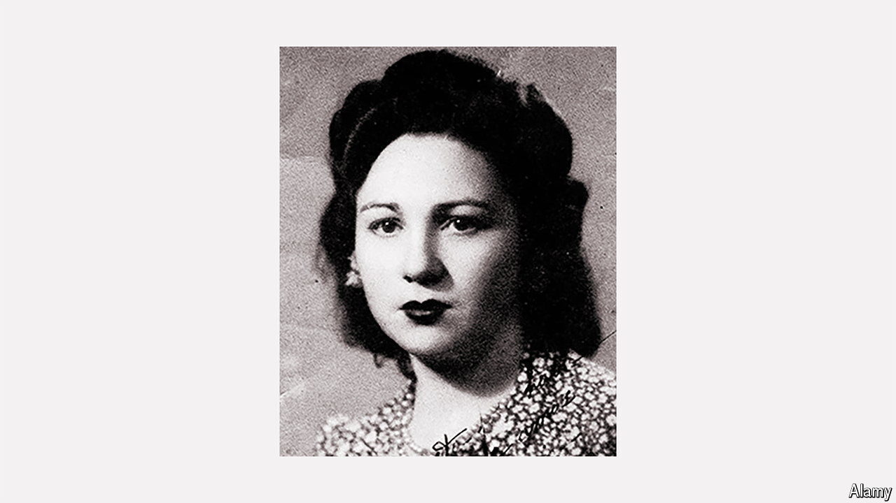

###### The keeper of memory

# Ángeles Flórez Peón, “Maricuela”, made sure Spain did not forget its history 

##### The last militiawoman who defended the Second Republic died on May 23rd, aged 105 

 

> Jul 4th 2024 

She never carried a rifle. Ángeles Flórez Peón was not one of those redoubtable women, in aprons or overalls, who lined up with guns at their shoulders in 1936 to shame the men into fighting. Instead, what she usually carried during her months as a , defending the Second Republic at the start of Spain’s civil war, was a huge pot of stew. She and her sister-comrades would cook it up and haul it to the front line at Oviedo. Sometimes they had to crawl beneath the bullets that crackled from balconies and windows. Her friend Angelita, covering for her one day, was killed outright by a sniper. She herself felt lucky to survive. 

When women were withdrawn from the front line, which annoyed her, she briefly became a nurse in a field hospital. It was set up in the cavernous spaces of an old match factory in Gijón, where she had charge of 30 beds. Here she carried mostly bandages and water. She did the job for two months only, but it was still enough to get her arrested, when Oviedo fell to General Francisco Franco’s forces, for that earned her 15 years in jail.

