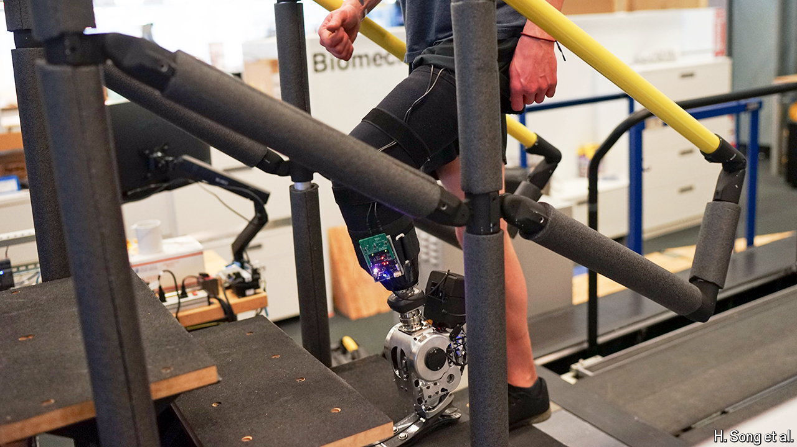

###### Best foot forward

# A new bionic leg can be controlled by the brain alone 

##### Those using the prosthetic can walk as fast as those with intact lower limbs 

 

> Jul 1st 2024 

BEFORE HUGH Herr became a professor at the Massachusetts Institute of Technology (MIT), he was a promising rock climber. But after being trapped in a blizzard during a climb at age 17, he lost both his legs below the knee to frostbite. Since then he has worked on creating prosthetic legs that would work and feel like the real thing. He appears to have succeeded.

In an article published on July 1st in , Dr Herr and his team at MIT describe seven people with below-the-knee amputations who can now walk normally with the help of surgery and new robotic prostheses. For the first time, Dr Herr says, people have been able to walk with bionic legs—mechanical prostheses that mimic their biological counterparts—that can be fully controlled by their brains.

