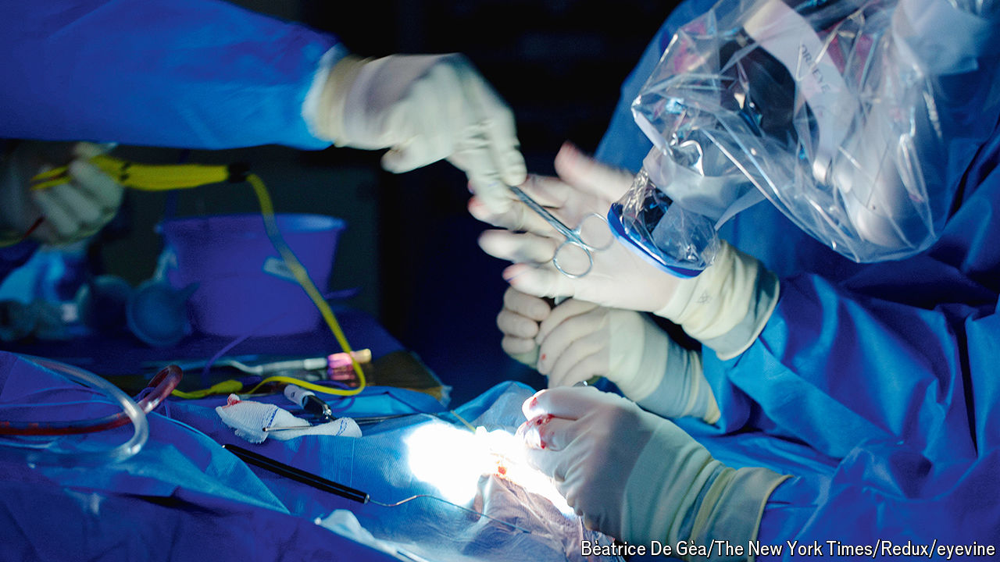

###### Neurosurgery

# A new technique could analyse tumours mid-surgery 

##### It would be fast enough to guide the hands of neurosurgeons 

 

> Jul 3rd 2024 

LÉO WURPILLOT was ten years old when he learned he had a brain tumour. To determine its malignancy, sections of the tumour had to be surgically removed and analysed. Now 19, he recalls the anguish that came with the subsequent three-month wait for a diagnosis. The news was good, and today Mr Wurpillot is a thriving first-year biomedical student at Cardiff University. But the months-long post-operative anticipation remains hard for patients to bear. That wait may one day be a thing of the past.

On June 27th a group of brain surgeons, neuropathologists and computational biologists met at Queen’s Medical Centre in Nottingham to hear about an ultrafast sequencing project developed by researchers at Nottingham University and the local hospital. Their work will allow brain tumours to be classified from tissue samples in two hours or less. As brain surgeries typically take many hours, this would allow results to come in before the end of surgery and inform the operation itself.

