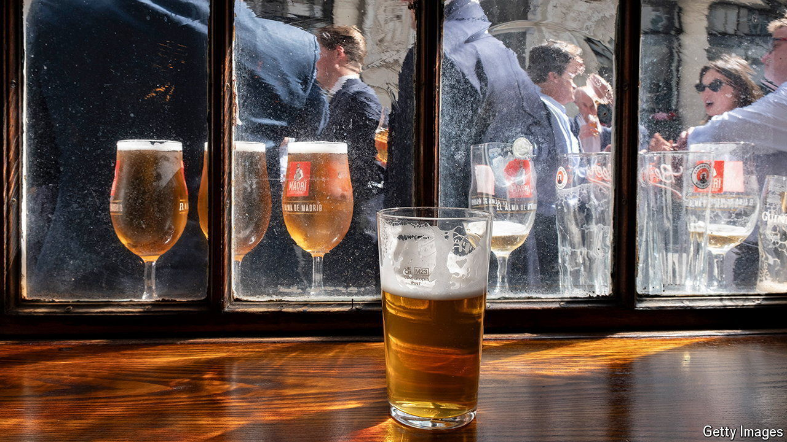

###### Brewed awakenings

# New yeast strains can produce untapped flavours of lager 

##### One Chilean hybrid has a spicy taste, with hints of clove 

 

> Jul 3rd 2024 

As frequent pub-goers will be well aware, beers come in two varieties—lagers and ales. Lagers are brewed at cool temperatures and typically have a crisp taste. Ales, known to be spicy and flavourful, are brewed in the warmth. Both get their distinctive flavours from fermentation—the conversion of sugars into alcohol and carbon dioxide—by single-celled fungi known as yeast. 

Different yeast strains fed the exact same sugary diet will create different flavours of beer. Yet lager-fanciers have been short-changed—there are only 85 strains of lager yeast, compared with 358 strains for ale. If a team led by Jennifer Molinet and Francisco Cubillos at the University of Santiago, in Chile, get their way, though, new types of lager may soon arrive, with completely different aromas and flavours from anything currently on tap.

