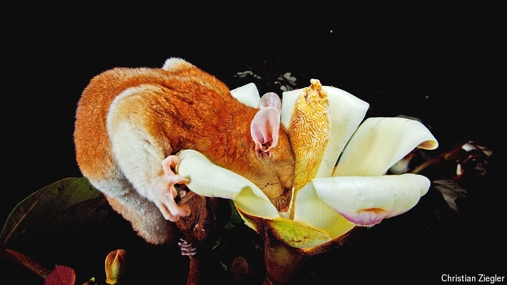

###### Tropical biology

# The world’s most studied rainforest is still yielding new insights 

##### Even after a century of research, a tropical rainforest in Panama continues to shed valuable light on the world’s abundance of natural life 

 

> Jul 3rd 2024 

CONSERVATIONISTS GENERALLY disapprove of flooding species-rich habitats. But the law of unintended consequences works in mysterious ways. For it was just such a flood, in 1913, that created Barro Colorado Island in central Panama. Gatun, the lake surrounding the island, was, at the time of its birth, the largest artificial body of water in the world. It formed the middle passage of the Panama Canal. Barro Colorado, meanwhile, has become the most intensively scrutinised scrap of tropical rainforest on Earth.

The field station from which this scrutiny is conducted opened in 1924, and in 1946 it was taken over by the Smithsonian Institution, which dubbed the operation the Smithsonian Tropical Research Institute (STRI). Since then, the island, and some neighbouring areas of forest on the mainland that have fallen under the STRI’s auspices, have turned into biology’s equivalent of a big physics facility like CERN, the home of the Large Hadron Collider. Though the STRI itself employs only 35 scientists, a further 1,200 visit each year, many of whom are regulars.

