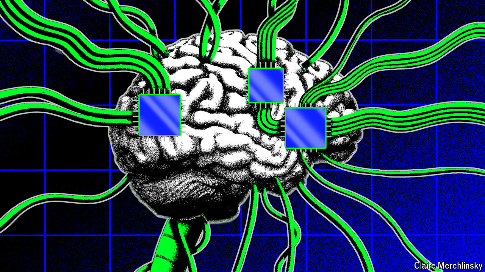

###### SpookGPT

# Artificial intelligence can speed-sort satellite photos 

##### Could it also recruit an agent? 

 

> Jul 1st 2024 

In 1957 Frank Rosenblatt, a psychologist, built a machine called the Perceptron. Modelled on the human brain, its neural networks were a forerunner of today’s artificial intelligence (ai). It intrigued the cia which was drowning in photos from spy planes and satellites. It funded the Perceptron in the hope of automatically identifying objects of interest. The experiment failed. There was not enough computing power, storage or training data available. But it was a start.

Spy agencies used machine learning to sift through images and text in the cold war, and then to identify patterns in billions of phone records after 9/11. Although advances in algorithms and computing power over the past decade have made those models faster and better, most agencies still believe ai will assist humans rather than replace them. However, the Perceptron’s successors, large language models (llms) like gpt-4, are beginning to challenge that assumption.

