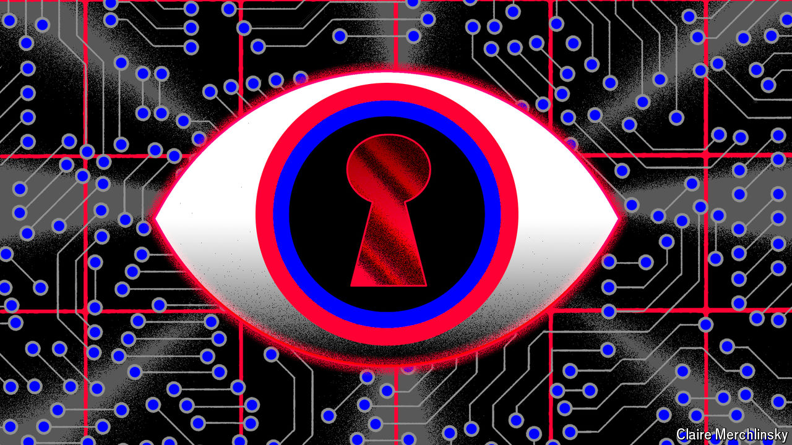

###### Intelligence, Inc

# Private firms and open sources are giving spies a run for their money 

##### There is plenty of co-operation, too 

 

> Jul 1st 2024 

As railways expanded across America in the 19th century, there was little law enforcement. Rail barons needed to keep track of threats. The Pinkerton detective agency frequently filled the gap, recruiting informants and passing dossiers to sheriffs. “That was the booming technology of that era,” says Andrew Borene, an American former intelligence officer. Today it is the internet. Mr Borene is executive director of Flashpoint, a “threat-intelligence” company which monitors terrorist groups and hostile intelligence services online, selling the information to governments and businesses. A few decades ago that work would have been the preserve of spy agencies. 

The deluge of data is fuelling a boom in private-sector intelligence. This is empowering intelligence services by giving them new tools, access to unclassified data which can be shared with the public and with allies. It is also easing their load: cyber-security firms have been as important as Western spy agencies in defending Ukraine from cyber-attacks. But the boom is also challenging those services by blurring the line between the open and the secret, raising questions over what must be done by spies and what can be done by others. And as data become more abundant, more revealing and more central to geopolitical competition, questions arise about law, ethics and privacy. “The separation of private- and public-sector interests is a uniquely Western construct,” argues Duyane Norman, a former cia officer, “one that has great advantages but also important consequences.”

