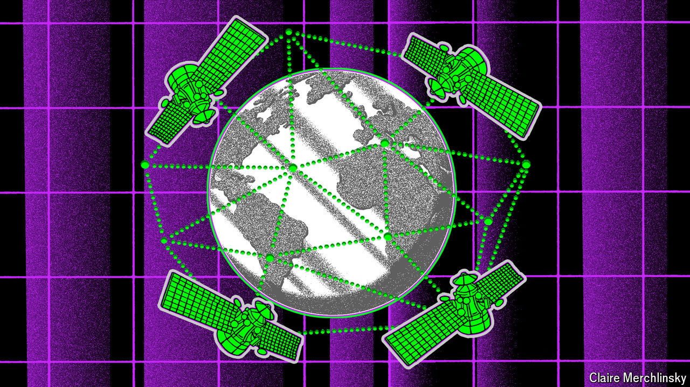

###### Dot-dot-dot dashed

# Signals intelligence has become a cyber-activity 

##### That has significantly changed its focus 

 

> Jul 1st 2024 

Eleven years ago Edward Snowden, a disgruntled contractor working for the National Security Agency (nsa), America’s signals-intelligence (sigint) service, fled to Hong Kong then Russia and revealed that America and its allies were sweeping up much of the world’s communications. Intelligence agencies warned that his disclosure would have dire consequences, as enemies found other ways to communicate. In the end it was not as bad as feared. Agencies could no longer access “all of the data they needed to see, or had access to before”, writes Ciaran Martin, then a senior official at gchq, Britain’s sigint agency. But they could still get “lots”, he notes. Indeed, enough to provide American sigint with the lion’s share of intelligence, including intercepts of communications, that showed in 2021 that Russia was planning to invade Ukraine, and how it planned to do so.

In the past two decades, sigint has been transformed. The internet took over from radio and telephone traffic in the 1990s. Now, a decade after Mr Snowden, most internet traffic is encrypted and data have pooled in new places, like the cloud. The same computer networks that ferry it about have also become integral to the physical world—from cars to power grids to military systems—blurring the line between cyber-espionage and cyber-attacks, and reshaping the identity of sigint agencies. But they remain extraordinary intelligence-gathering machines. 

