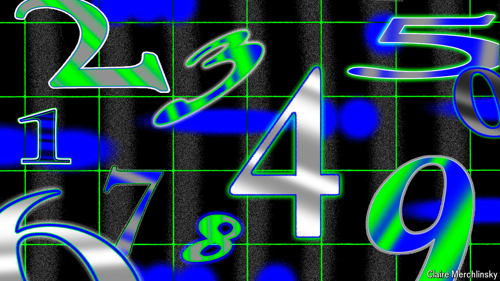

###### Old-school broadcasts

# Sometimes the old ways of espionage are the best 

##### Encrypted messages on the radio are still going strong 

 

> Jul 1st 2024 

From the mid-1960s until 2008 anyone tuning a radio to shortwave frequencies between 5.422 and 16.084 mhz would periodically hear a jaunty flute playing a few bars of an English folk song. Then, in a clipped English accent, a female voice would read out numbers: “Zero, two, five, eight…” The transmissions were thought to be coded messages from mi6. The “Lincolnshire Poacher”, named after the jaunty tune, was one of many “number stations” used by spy agencies to communicate with agents in the field. 

Some were wound up at the end of the cold war. What is curious is that so many persist: indeed , a website which tracks these stations, notes that activity has “significantly increased” since the mid-2010s, with broadcasts in voice, Morse code and digital signals. Russia is still a particularly keen user. With all the new technologies available, why use radio broadcasts? 

