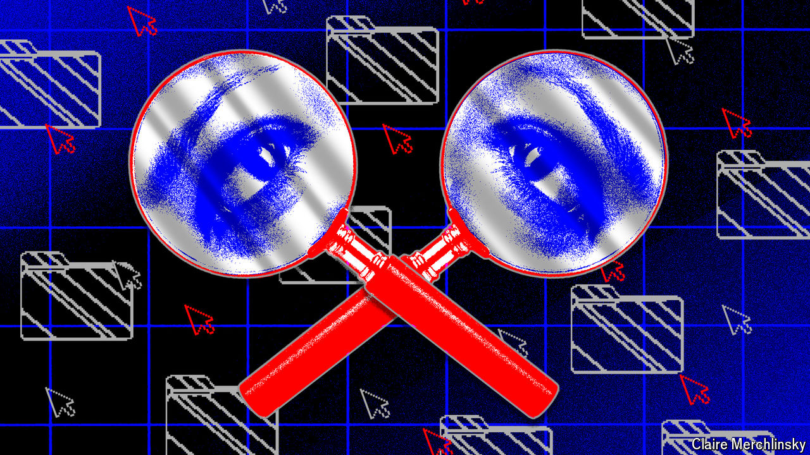

###### New-look spooks

# The tools of global spycraft have changed 

##### And so has the world in which they are used, says Shashank Joshi 

 

> Jul 1st 2024 

A few years ago intelligence analysts observed that internet-connected cctv cameras in Taiwan and South Korea were inexplicably talking to vital parts of the Indian power grid. The strange connection turned out to be a deliberately circuitous route by which Chinese spies were communicating with malware they had previously buried deep inside crucial parts of the Indian grid (presumably to enable future sabotage). The analysts spotted it because they were scanning the internet to look for “command and control” (c2) nodes—such as cameras—that hackers use as stepping stones to their victims. 

The attack was not revealed by an Indian or Western intelligence agency, but by Recorded Future, a firm in Somerville, Massachusetts. Christopher Ahlberg, its boss, claims the company has knowledge of more c2 nodes than anyone in the world. “We use that to bust Chinese and Russian intel operations constantly.” It also has billions of stolen log-in details found on the dark web (a hard-to-access part of the internet) and collects millions of images daily. “We know every uk company, every Chinese company, every Indian company,” says Mr Ahlberg. Recorded Future has 1,700 clients in 75 countries, including 47 governments. 

