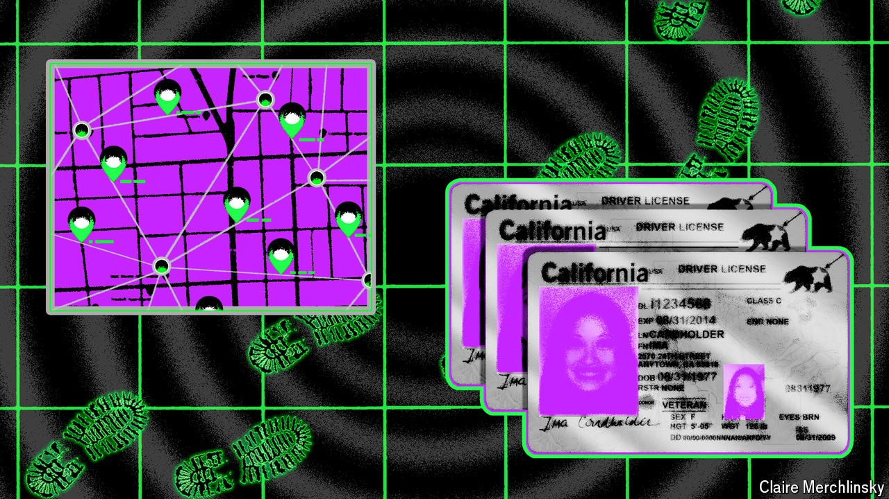

###### Dead drop drops dead

# Ubiquitous technical surveillance has made spying more difficult 

##### But human intelligence is still vital 

 

> Jul 1st 2024 

Jon (not his real name, for reasons that will become apparent) distinctly remembers the shock. He had served in a Western intelligence agency as a case officer, one of the men and women tasked with coaxing foreigners to give up secrets by becoming agents. He was browsing LinkedIn, a social-media site used for networking and job-hunting. The website’s algorithm suggests connections: old school friends, former colleagues and the like. On this occasion it threw up an unwelcome name: one of Jon’s former agents.

The connection may have been a coincidence. Or it may have been an illustration of the way in which “digital dust”—vast quantities of data, sifted with artificial intelligence—can expose secrets and the people who harbour them. 

