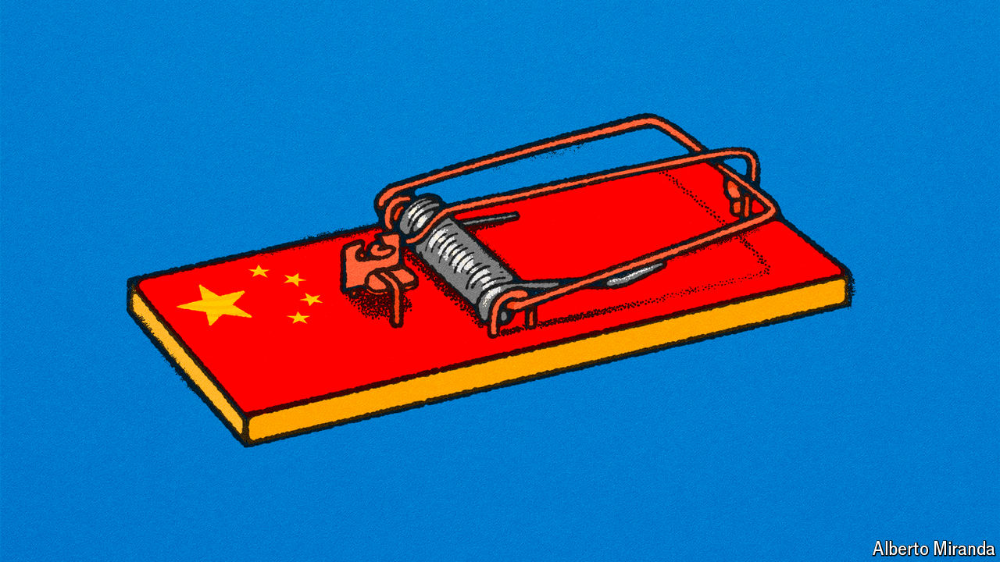

###### The sleepwalkers

# China’s presence in Latin America has expanded dramatically 

##### The region’s leaders are failing to consider the risks of growing dependence 

 

> Jul 4th 2024 

Its main breakwater is visible from a plane at 6,000 metres (20,000 feet), a hook jutting into the Pacific from Peru’s tawny coastal desert. In November, if all goes to plan, President Xi Jinping of China will inaugurate the vast new port at Chancay, 70km (44 miles) north of Lima on which Cosco, a Chinese company, and its local partner have so far spent $1.3bn.

Chancay typifies the footprint that China has stamped on Latin America in this century. Two-way trade has climbed from $18bn in 2002 to $450bn in 2022. While the United States remains the biggest trade partner for the region as a whole, China is now the biggest in South America—with Brazil, Chile, Peru and others. The Asian giant’s presence is not just economic. Its ambassadors are well versed in Latin America, and speak good Spanish and Portuguese. Its diplomatic staff has been expanding. The United States, by contrast, often leaves ambassadorial posts vacant because of political gridlock in Washington. Local officials, journalists and academics are offered free trips to China. During the pandemic China sent vaccines to Latin America much faster than did the United States or Europe. 

