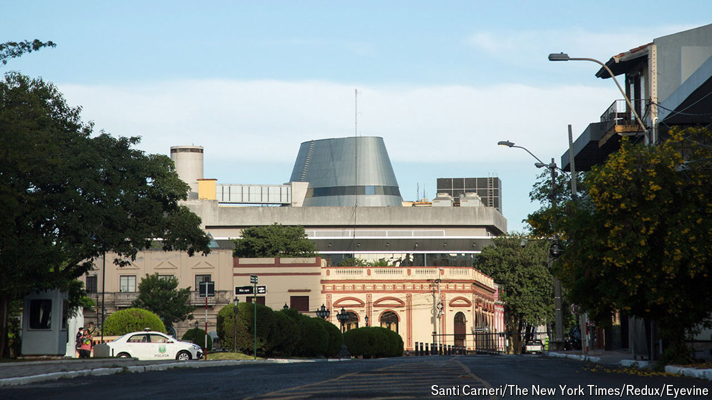

###### The other China

# Paraguay and Taiwan strengthen their embrace, for now 

##### Paraguay has benefited from increased Taiwanese investment, but will it be enough to ward off the lure of Beijing? 

 

> Jul 4th 2024 

When Taiwan’s new president, Lai Ching-te, took office in May, his first meeting was with Santiago Peña, the president of Paraguay. It is one of just 12 countries that recognise Taiwan as the legitimate China, rather than the larger People’s Republic of China. 

China claims Taiwan as its territory. Formal links with other countries lend legitimacy to Taiwan’s claim to statehood. Paraguay, together with Guatemala, is one of Taiwan’s largest remaining friends. The country advocates for Taiwan at the United Nations, from which the Asian island is excluded. 

