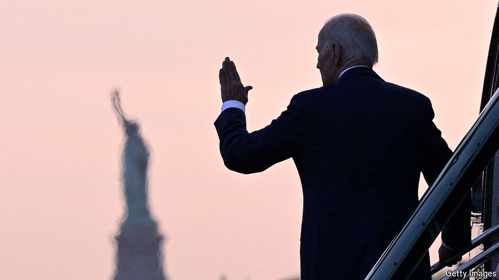

###### The Economist explains

# How could Democrats replace Joe Biden as their candidate for president? 

##### And who could replace him on the ticket? 

 

> Jun 28th 2024 

PRESIDENT JOE BIDEN’s performance in his  with Donald Trump, on June 27th, . With Democratic figures asking if a way can be found to replace him as the candidate for the election in November, what are the options? The main trouble is that he has comfortably secured enough delegates to win his party’s nomination. That means that only one person can change who will be the Democratic candidate to face Donald Trump: Mr Biden himself.

The rules do not allow for a rerun of a popular election. To become the party nominee, a candidate needs to win a majority of delegates to the Democratic national convention. The number needed is 1,968 and Mr Biden has already gathered 3,894 because he has run virtually unopposed. No one, including delegates to the convention, can force the president to step aside. But if he were persuaded to withdraw (whether by his wife, or by a posse of Democratic grandees), these delegates would become unbound and therefore free to vote for the nominee of their choosing. 

