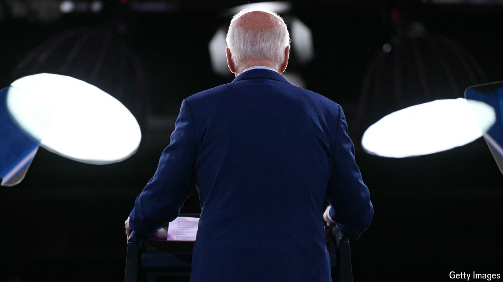
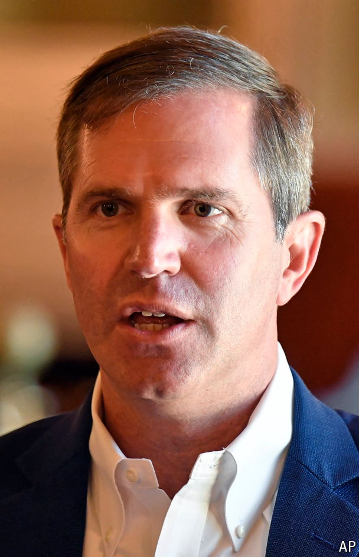

###### The Economist explains

# Who could plausibly replace Joe Biden? 

##### The Democrats have a deep bench of talent 

 

> Jun 29th 2024 

Long before  between Joe Biden and Donald Trump on June 27th mercifully reached the 90-minute mark, names began popping up on serious social-media accounts. There had previously been no question that Mr Biden would be the Democratic Party’s nominee. Then the president’s bumbling performance made it a . Here are brief profiles of ten plausible alternatives to Mr Biden. We selected them not because we would necessarily favour them, nor because they represent all of the party’s wings—but because we think they would have the best chance of winning over a . The party has credible leaders who run states, manage federal departments and have birth certificates that were issued after D-Day.

 


