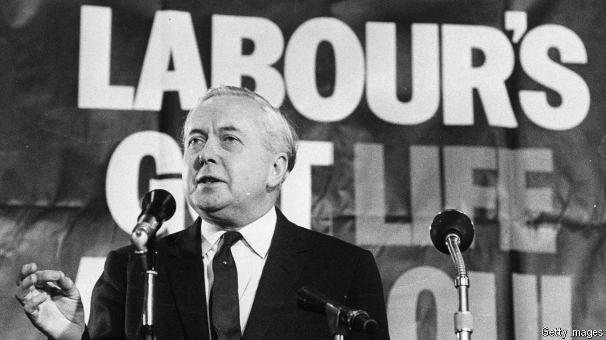

###### The Economist reads

# The best and worst memoirs by British prime ministers 

##### There are plenty of duds, but a few gems 

 

> Jul 3rd 2024 

IF RISHI SUNAK moves out of 10 Downing Street this week will he be tempted to tap out his version of the 20 months he spent inside it? His immediate predecessor, , published a memoir of sorts, more a bid for a political afterlife than a chronicle of her disastrous 49 days in office. Boris Johnson, who may have done as much damage but took more time to do it, signed up last year with Harper Collins to tell his prime-ministerial story. There’s money in memoirs (though Mr Sunak doesn’t need it; he and his wife are richer than King Charles). But the main motivation to pick up the pen is probably the one expressed by Winston Churchill: “History will be kind to me, for I intend to write it.” (In fact he put the thought less pithily.) That can mean being entertainingly unkind to others. More often, though, it merely makes self-congratulation the dominant theme in a narrative of bills enacted and summits attended. Here are seven of the worst and best. 

 By Robert Peel. 

