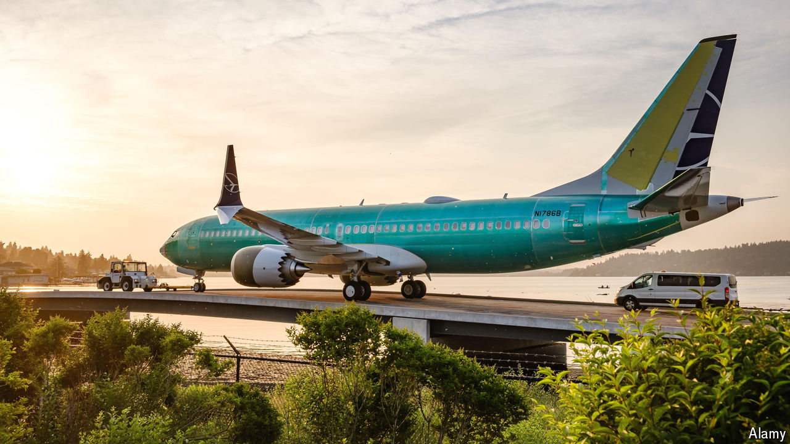

###### The world this week

# Business 

#####  

 

> Jul 4th 2024 

 agreed to buy , a maker of jet fuselages that Boeing hived off from its operations in Wichita in 2005, in an $8.3bn transaction. Reincorporating Spirit will help Boeing streamline its production process after a host of claims about shoddy workmanship. Spirit built the door panel that blew off a 737 MAX upon take-off in January. It also produces parts for Airbus. That business will be sold to the European aerospace company as part of the deal. 

 delivered almost 444,000 electric vehicles in the second quarter. Although that was down by nearly 5% from the same period last year and was its second consecutive quarterly sales decline, the carmaker’s share price surged, as markets were expecting a bigger drop. , a Chinese rival, increased its deliveries of pure battery EVs by 21%, to 426,000, so Tesla keeps its crown as the world’s biggest EV seller, for now. 

