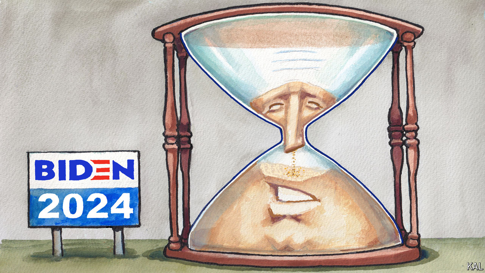

###### Lexington

# Joe Biden is fooling only himself 

##### A president who prides himself on the common touch is insulting everyone’s common sense 

 

> Jul 3rd 2024 

Despair as you may about American politics, polls suggest a stubborn cause for hope: Americans still do not appreciate being treated like fools. Regardless of what alternative facts their politicians insist upon, most voters do not ignore their common sense or life experience or the evidence of their eyes and ears. 

This helps explain why former president Donald Trump has never had majority support, and why President Joe Biden’s  on June 27th did not much affect public opinion of his ability to do the hardest and most important job in the world. Yes, 72% of registered voters told CBS afterwards that they thought he lacked “the mental and cognitive health to serve as president”—but, in answer to the same question just three weeks earlier, fully 65% said the same thing. Such doubt was not new: back in 2022, barely a quarter of Democrats told pollsters they wanted to see Mr Biden renominated; those who were opposed cited his age as their biggest concern. Until the debate, Mr Biden and his aides were fooling only themselves, their truest believers, and those partisans for whom it was convenient to believe. 

