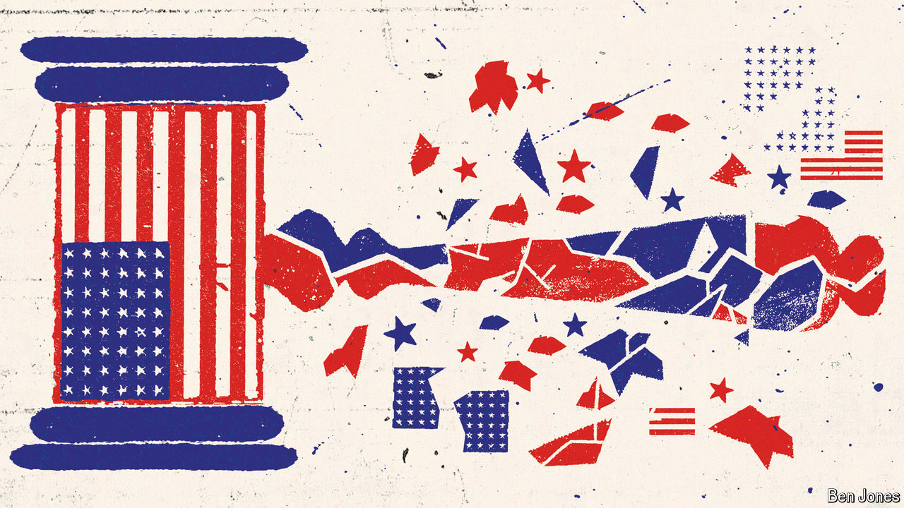

###### Supremely controversial

# The Supreme Court’s term ends with a rash of divisive rulings 

##### Big decisions arrived on guns, abortion, homelessness, presidential power—and more 

 

> Jul 4th 2024 

BEFORE presenting her opinion in a sleeper case on July 1st, the final day of the Supreme Court’s term, Justice Amy Coney Barrett elicited chuckles in the courtroom. “Sorry,” she quipped, announcing the result in , “this is not one of the cases you’re waiting to hear.” Chief Justice John Roberts would deliver the highly anticipated presidential-immunity decision—smoothing over Donald Trump’s most profound legal troubles—a few minutes later. 

Justice Barrett’s downplaying of that case was misplaced. In her dissent, Justice Ketanji Brown Jackson contended that the decision magnified the fallout from  the case that spelt the demise of the  doctrine. This might have been the most important rule governing government that most Americans had never heard of—until the court struck it down this term too. “The tsunami of lawsuits against agencies” would empower plaintiffs to challenge long-settled regulations issued by federal agencies, she warned, and could “devastate the functioning of the federal government”.

