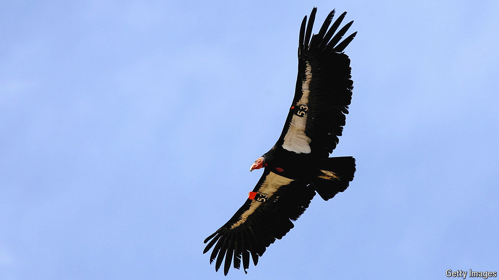

###### Vulture capital

# The unsteady comeback of the California condor 

##### The bird’s plight is a study in unintended consequences 

 

> Jul 4th 2024 

IT MAY HAVE been the smelliest job in conservation. Whoever drew the short straw sat in a hole in the dirt underneath a carcass. Then they waited for a California condor to come and have a snack. “That’s not a pretty job at all,” says Chandra David, an animal keeper for the Los Angeles Zoo. “When a bird would land somebody would radio in saying ‘Now!’ and they would reach up and grab the bird’s legs.” This, and other less nauseating methods, is how the last remaining condors were brought in from the wild in the 1980s. 

Californian condors are a species of vulture; they feed on dead animals. Adults can have a wingspan of up to three metres, making them the largest land bird in North America. As America’s population grew in the 19th and 20th centuries, the birds’ numbers plummeted. They were placed on the federal endangered-species list in 1967, but they continued to die off. Their near-demise, and recent comeback, provide a study in unintended consequences.

