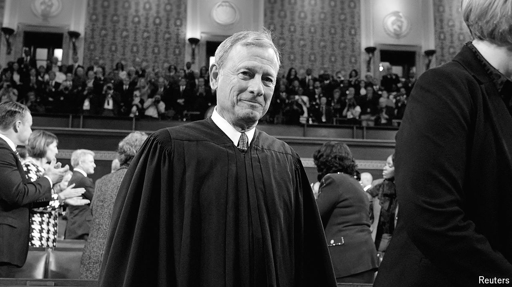

###### Bureaucratic power

# What the Chevron ruling means for the next US president 

##### The Supreme Court weakened regulators and created uncertainty, inviting a “tsunami of lawsuits” 

 

> Jul 4th 2024 

THE QUESTION confronted by the Supreme Court in —whether the Magnuson-Stevens Act of 1976 implies that herring fishers in the Atlantic can be forced to pay the salaries of federal inspectors riding on their boats—might appear to be, well, small fry. Yet while the Supreme Court issued many consequential decisions this term,  may turn out to be the most important of the lot.

That is because the court’s conservative 6-3 majority used the case to strike a mighty blow against the American administrative state. Its ruling on June 28th eliminated a precedent called “ deference”, named after a landmark case from 1984, that instructs courts to defer to federal agencies when their authority is left ambiguous by a law (as it frequently is). For decades,  justified countless rules and regulations; under it, agencies and bureaucrats in charge of environmental, labour and financial matters made expansive use of the vague authorities delegated to them by Congress. 

