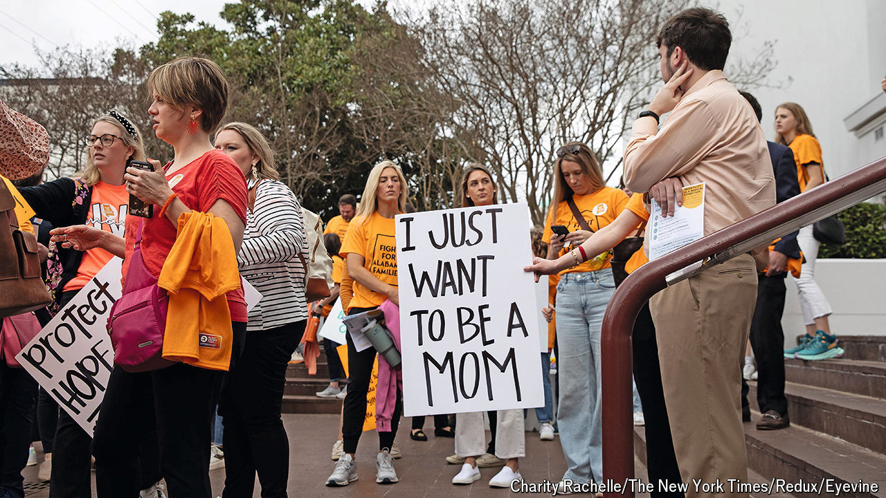

###### Fertile ground

# Will IVF really be the next frontier in America’s culture wars? 

##### Banning it would be political suicide. But it could get harder to find in conservative states 

 

> Jul 4th 2024 

Moral inconsistency is a pretty normal part of the human condition. Attitudes to in-vitro fertilisation (IVF) are a case in point. While the vast majority of Americans support access to the technology, which now accounts for over 90,000 births per year, many struggle with a key component of it: the destruction of embryos in the process. Indeed, whereas 82% of Americans believe IVF is morally acceptable, only 49% say the same about destroying excess embryos, according to recent polling by Gallup. This presents moral purists with a conundrum.

So far, Americans have mostly been able to hold such competing views. Even among those who believe that an embryo is a person with rights, only about one in ten say access to IVF is a “bad thing”, according to Pew Research Centre. Yet state courts, state legislatures and pressure from the Christian right are making the contradiction harder to sustain. In February Alabama’s Supreme Court ruled that embryos created through IVF counted as children under state law, causing the temporary closure of fertility clinics. In June the Southern Baptist Convention, which represents 13m Christian evangelicals, overwhelmingly voted to oppose IVF as currently practised, calling it “dehumanising”, and calling on the government to curtail it. 

