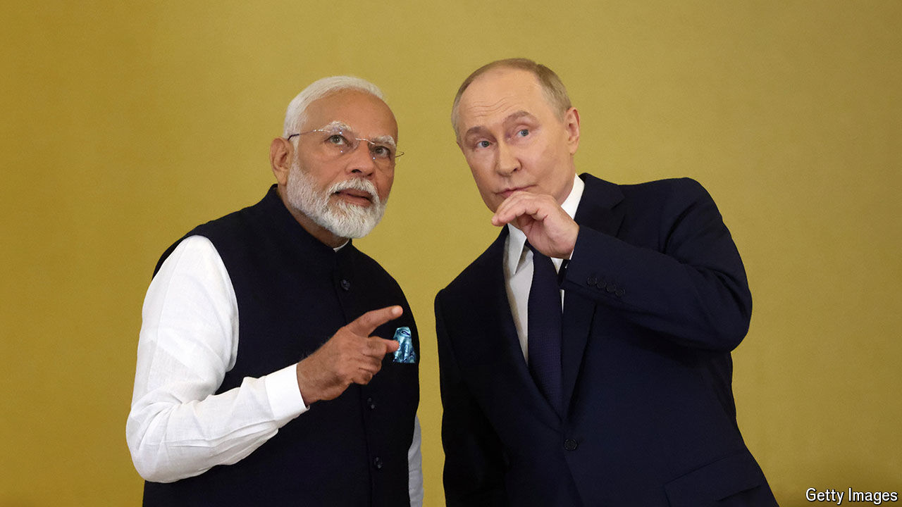

###### Bear-hugging bros

# Narendra Modi cuddles up to Vladimir Putin in Moscow 

##### India’s prime minister visited amid fresh Russian atrocities in Ukraine 

 

> Jul 10th 2024 

FOR TWO and a bit years India has walked a tightrope when it comes to Russia. Indian officials have refused to condemn its invasion of Ukraine, citing a history of close ties with the Kremlin, as well as India’s need for cheap Russian weapons and . At the same time, India has tried to avoid Western criticism by consistently calling for peace, and by presenting itself as a trusted partner for the West in its efforts to manage China’s rise. 

Up to now this approach has paid off. But it came under unusual scrutiny when India’s prime minister, , visited Moscow from July 8th to 9th—his first trip to Russia since 2019. Mr Modi was filmed bear-hugging Russia’s president, , before touring his residence in a golf cart, sharing a private dinner and watching a display by performers on horseback. 

