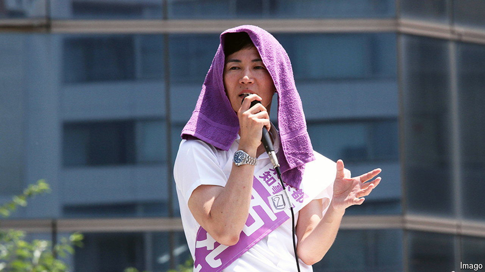

###### Politics in Japan

# Social-media populists have arrived in Japan 

##### A small-town mayor shakes up Tokyo’s city election 

 

> Jul 11th 2024 

Politics in Japan can be a staid affair. The race to become the governor of Tokyo, which reached its climax on July 7th, was anything but that. Fifty-six candidates, many of them eccentrics, traded barbs. Pets featured on election posters; so, in one case, did pornography. A candidate dressed as the Joker from “Batman” spouted nonsense on national television. Another took off her clothes. 

In the end Koike Yuriko, the incumbent governor, bagged herself a third term with some 43% of votes. Yet it was the second-place finisher—Ishimaru Shinji, an outspoken but little-known former banker—who stole the headlines. Up to now, Japanese voters have seemed curiously unmoved by the kinds of social-media-fuelled populism that have upturned politics in other countries. That no longer seems so true.

