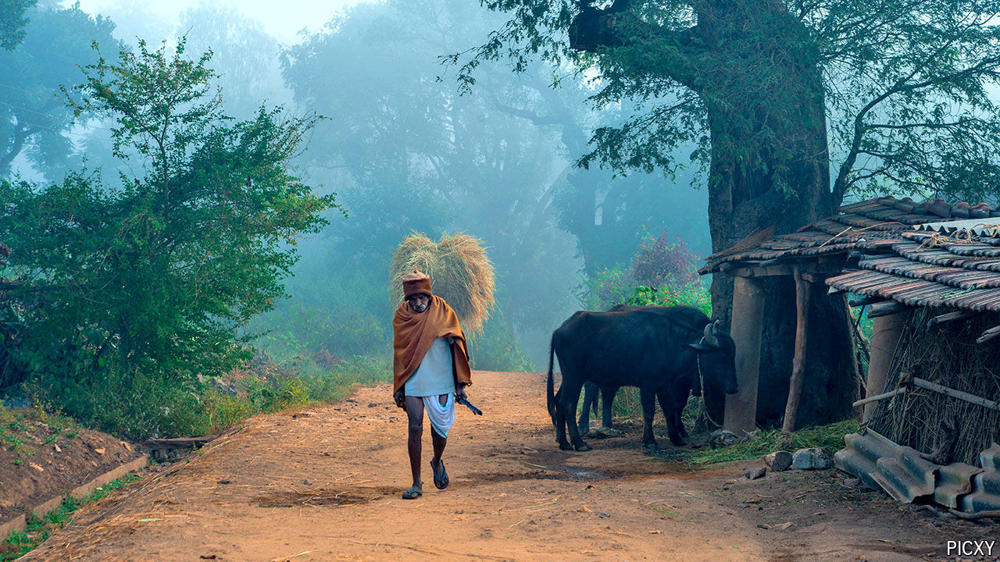
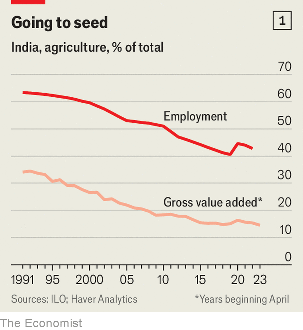

###### No business like sow business

# The world’s next food superpower 

##### Farming in India should be about profits and productivity, not poverty 

 

> Jul 11th 2024 

FOR YEARS the Araku Valley, deep in the mountains on India’s east coast, was mired in poverty and rocked by Maoist violence. The government classifies most of its inhabitants as “particularly vulnerable tribal groups”; for generations they relied on slash-and-burn farming to scrape by. But now locals grow high-grade coffee that is sold at high prices to posh Europeans. Araku Coffee, the company that processes and markets their berries, runs cafés in fancy bits of Bangalore, Mumbai and Paris. The valley’s transformation is an agricultural success story. It is also a glimpse of what—with the right policies—the rest of  might achieve.

 


Indian agriculture has come a long way since the “ship-to-mouth” days of the 1950s and 1960s, when the country depended on food aid from abroad. It has long since become a net exporter of stuff people eat. Yet big inefficiencies persist. Although India has a third more land under cultivation than , it harvests only a third as much produce by value, according to analysis by Unupom Kausik of Olam, an agri-business listed in Singapore.  employs almost half of all Indian workers—some 260m people—but contributes only 15% of output and 12% of exports (see chart 1). By contrast, business services such as call centres and IT companies employ less than 1% of workers but produce 7% of GDP and almost a quarter of exports.

