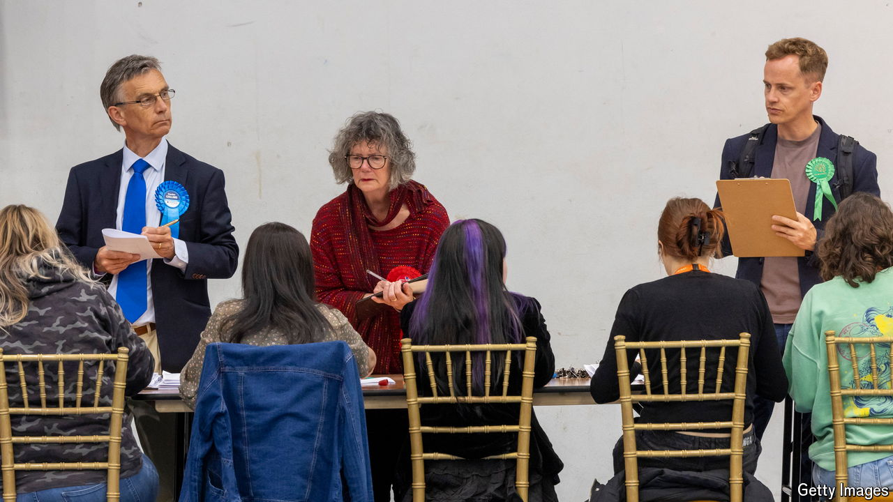

###### Disproportional representation

# Britain’s general election was its least representative ever 

##### The rise of multi-party competition will build pressure for electoral reform 

 

> Jul 11th 2024 

IT CAN SOUND like so much bleating from bad losers. Some members of the Conservative Party, which has dominated elections since the 19th century by mastering Britain’s first-past-the-post (FPTP) electoral system, do not much like being on the other end of a drubbing. Labour’s majority is a “mile wide and an inch deep”, grumbled Boris Johnson, a former prime minister. Other Tories gripe that there isn’t “any enthusiasm” for the party that just routed them in the general election on July 4th. The implication is that voters have handed Sir Keir Starmer, the new prime minister, a huge majority by accident. 

