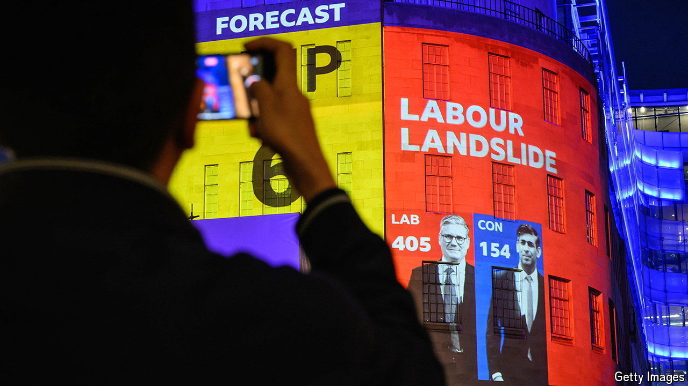
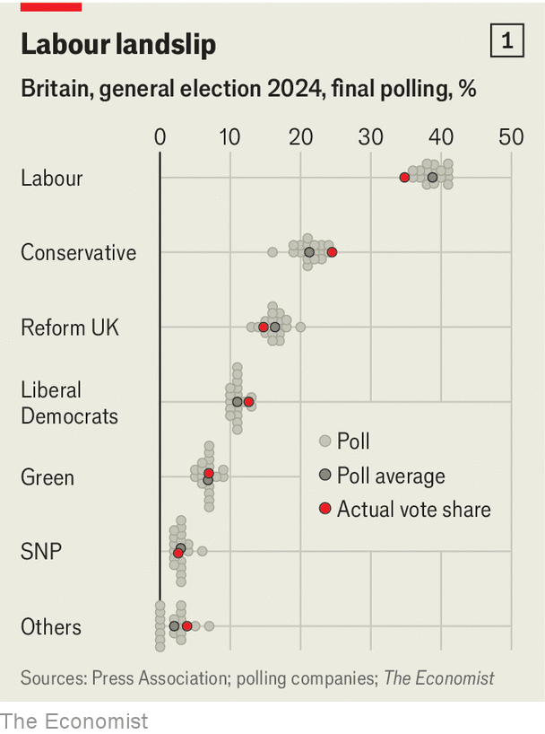

###### Poll post-mortem

# How did pollsters do in predicting the British election? 

##### The biggest miss since 1992 

 

> Jul 8th 2024 

THERE WAS no shortage of predictions about how Britain’s general election would pan out on July 4th. A huge amount of data gathered over the six weeks of the campaign—144 national polls in all, surveying a total of 622,000 people—pointed to one outcome: a . That outcome duly materialised: Labour’s haul of 411 seats gives it a working majority of 181 in the new Parliament, which began on July 9th. Even so, the polling firms did not cover themselves in glory. 

 


