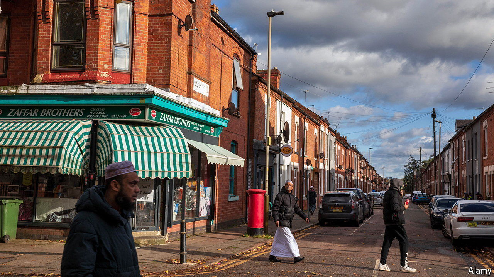

###### Independents’ day

# How the Gaza war affected the British election 

##### Deciphering the striking success of independent candidates 

 

> Jul 11th 2024 

“In general independent candidates do not do very well in Westminster elections,” says Matt Singh, a pollster. That changed in the general election on July 4th, when the  but also lost five of its safest seats to independents. Their victories mean there are now six independents in Parliament, the most elected since 1945. With the exception of a unionist in Northern Ireland, all campaigned heavily on Gaza. 

