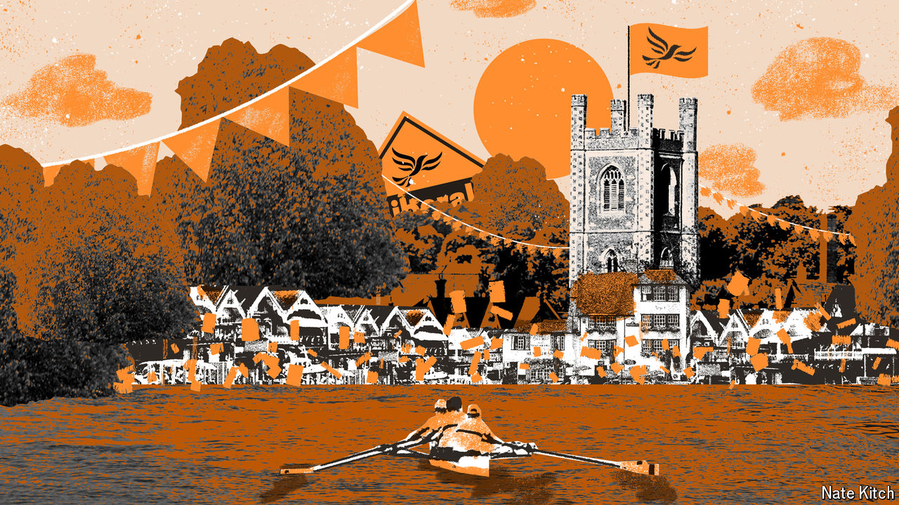

###### Bagehot

# The new front line of British politics is just lovely 

##### From the “left-behind” to the “well-ahead” 

 

> Jul 10th 2024 

Picture an idyllic British summer scene and the mind will generally conjure up an image of rich people having a lovely time. It might be a pink-faced crowd watching tennis at Wimbledon. Maybe it is men in blazers cheering rowers at Henley Royal Regatta. It could be horsey people roaring on their four-legged cousins at Glorious Goodwood, a fancy race meeting. In other words, you are picturing a  constituency. 

On July 4th the Lib Dems  in their prosperous heartlands across southern England, cantering to victory in seats such as Wimbledon, Henley and Thame, and Chichester. The electoral consequences were profound: the Liberal Democrats gained 61 seats almost entirely from the Conservatives, enough to condemn the Tories to opposition even before Labour bulldozed through more marginal seats on the way to a . The political consequences will be profound, too. There is a new frontline in British politics—and it is just . 

For years British politics has focused almost entirely on rather grim places. Bellwether seats can be unappealing. Few tourists visit Harlow in Essex. People live in Dartford, a town in Kent, because of its convenience for London rather than because it is particularly nice. After the 2019 general election political attention turned to poorer seats in  such as Teesside, which are tough to love. 

