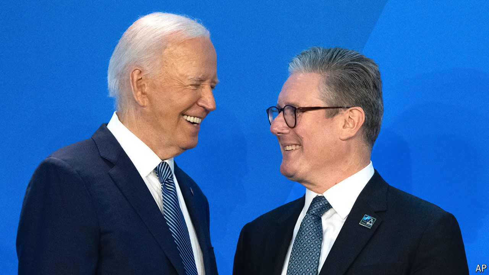

###### Labour and the world

# What does Labour’s win mean for British foreign policy? 

##### Continuity on NATO and Ukraine, and hopes for a reset with Europe 

 

> Jul 9th 2024 

SIR KEIR STARMER enjoyed many strokes of luck en route to  on July 5th. The diary of diplomacy has handed him two more. On July 9th Sir Keir and some of his most senior ministers left for a summit in Washington, DC, to mark . And on July 18th, just a fortnight into the job, Sir Keir will host a meeting of the  (EPC), a loose gathering of states in and around the European Union, at Blenheim Palace, a vast Baroque edifice where Winston Churchill was born. 

These two events, and the EPC in particular, will give the new Labour government an immediate stage to signal where Britain’s foreign policy will stay the same and where it will shift. They will also reinforce the biggest change of all, to the country’s reputation. Almost overnight an exaggerated image of Britain as a chaotic clown-show—true under , a bit less so for Rishi Sunak—has flipped to an idealised image of stable government led by a serious-minded centrist. 

On most of the foreign-policy fundamentals—principally Nato, Ukraine and the relationships with America and China—there is lots of continuity between the new government and the old. In Washington, Sir Keir affirmed Britain’s “unshakable” support for the alliance. Re-embracing NATO was an essential part of his project to make Labour fit for power again after the tenure of Jeremy Corbyn, his leftist predecessor. 

