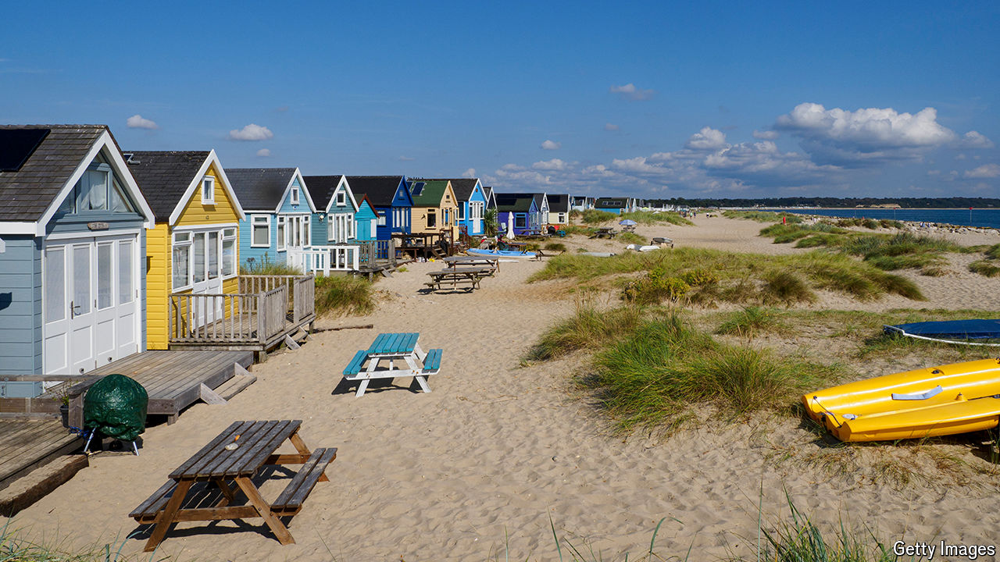

###### Shore things

# Why are British beach huts so expensive? 

##### Scarcity and sentimentality drive the market 

 

> Jul 11th 2024 

British seaside towns contribute more than their fair share of the country’s iconography: fairground piers, fish and chips, Punch and Judy puppet shows. High on that list are beach huts—those “colourful sentinels on the border between land and sea”, in the words of Kathryn Ferry, a historian and co-founder of the Seaside Heritage Network, which campaigns for a renewed appreciation of the country’s often-faded coastal resorts. 

