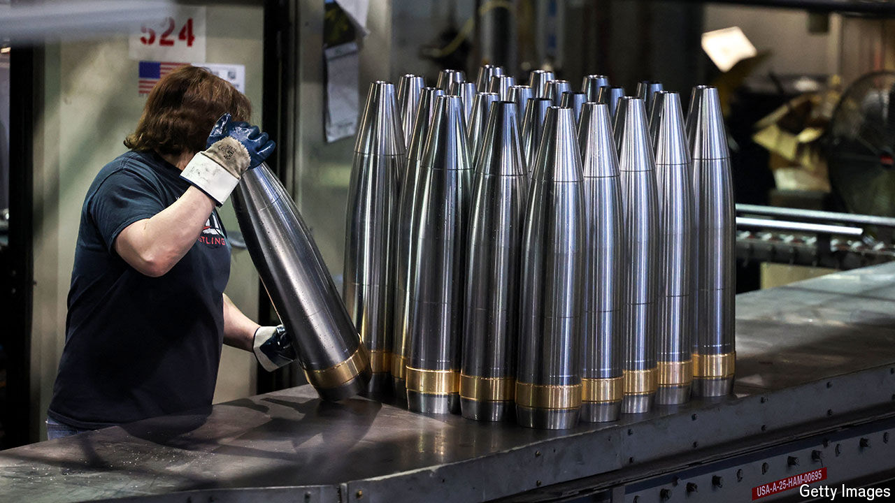

###### Past their prime

# America’s giant armsmakers are being outgunned 

##### Why there is little sign of a defence-industry bonanza in a post-peace world 

 

> Jul 7th 2024 

ARMSMAKING IS NOT like other businesses. It is impervious to macroeconomics and sheltered from fickle consumer tastes. Its prospects are determined by one factor—how militarily threatened its government customers are feeling. With wars blazing in Ukraine and Gaza, another on the brink between Israel and Lebanon, and more conflict looming as China eyes Taiwan, the perceived threat level as leaders of NATO countries gathered for a summit in Washington from July 9th to 11th was through the roof. 

