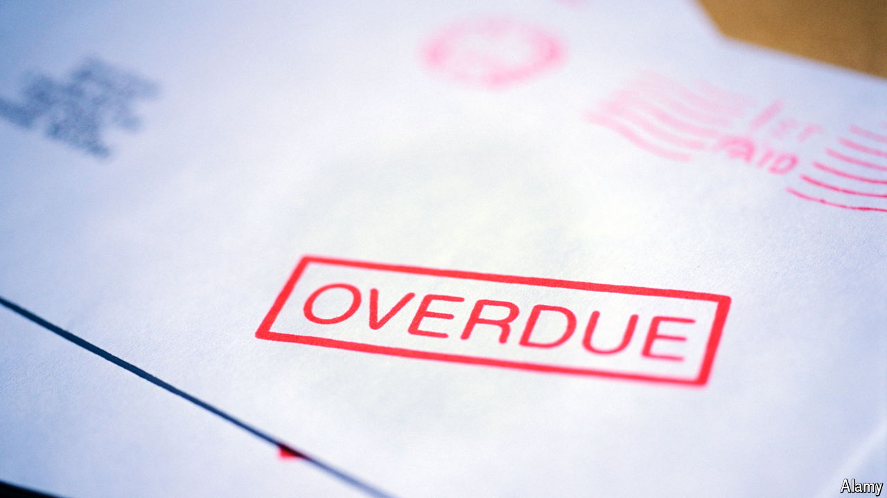

###### Where’s my money?

# Europe’s biggest debt-collector has a debt problem 

##### Intrum gets into hot water with its creditors 

 

> Jul 11th 2024 

Behind every on-screen loan shark is an even harder character making sure the mob’s debts are paid—make Peter pay, or Paulie might break your legs. The financial system is less violent, but similarly interconnected. Intrum, Europe’s biggest debt collector, has struggled to make its business of buying and settling bad loans work. Now it is under pressure from its own excessive borrowing. The firm’s $6bn pile of debt trades at levels indicating deep distress. So do its shares, whose value has fallen by half this year (see chart).

