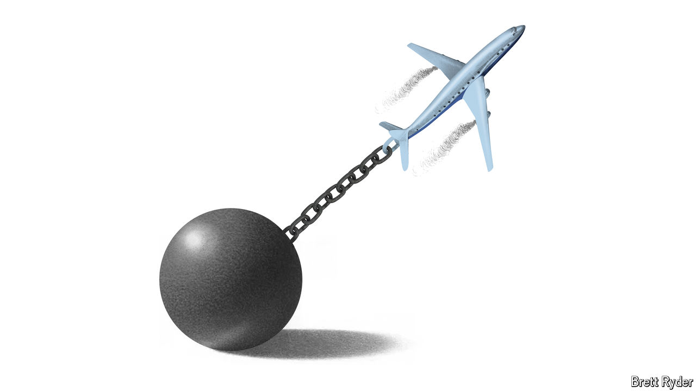

###### Schumpeter

# Once high-flying Boeing is now a corporate criminal 

##### Its woes illustrate the excesses of a lean-and-mean era in corporate America 

 

> Jul 8th 2024 

At the turn of the century Boeing launched an advertising blitz to show what a marvel of American manufacturing it was. Called “Forever New Frontiers”, it highlighted its pioneering work on some of the 20th century’s biggest breakthroughs, from passenger and fighter jets to space rockets and satellites. Coming a few years after its merger with McDonnell Douglas, a smaller rival, Boeing stood tall in the fast-consolidating aerospace industry. 

 since. On July 7th the American government said Boeing had agreed in principle to plead guilty to fraud in connection with two deadly crashes by its  in 2018 and 2019. This latest frontier, its most disgraceful yet, makes it the corporate equivalent of a criminal. Looking back over the decades, it becomes clear that Boeing’s embrace of what were once the defining trends in American business have come back to haunt it. 

First, the tie-up with McDonnell Douglas in 1997 was part of what  then approvingly called “one of the great industrial upheavals of all time”: the hammering together of America’s fragmented defence industry into a few global Goliaths. Since then consolidation has been the name of the game across corporate America. The second trend was outsourcing. In 2005 Boeing joined the rush to offload capital-intensive manufacturing and cut labour costs by selling off parts of its production line, becoming an assembler of planes rather than a vertically integrated manufacturer. Third, like many listed American firms, Boeing showered stockholders with cash via share repurchases and dividends rather than investing in non-financial innovation.

