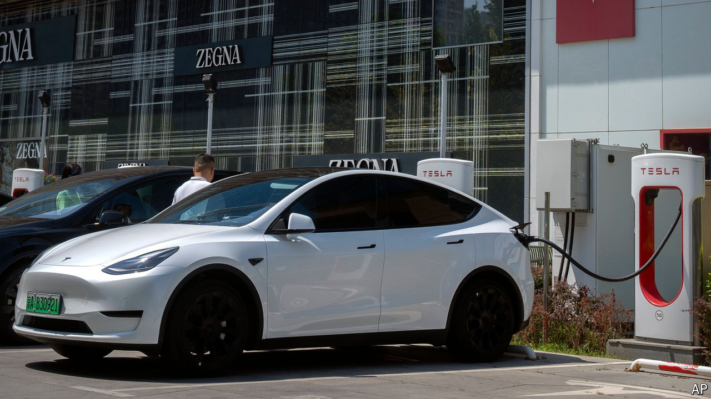

###### Tit for tat, not Tesla

# The EV trade war between China and the West heats up 

##### But Elon Musk’s carmaker is somehow escaping the worst of it 

 

> Jul 10th 2024 

IN the TRADE war between the West and China, a battle over  (evs) has begun. In May, as part of a broader volley against Chinese tech, America slapped a 100% duty on Chinese evs. On July 2nd Canada launched a consultation on what it called “unfair Chinese trade practices” in the EV industry. Three days later a provisional tariff of up to 37.6% on Chinese EVs took effect in the EU. On July 10th, days after the symbolic swipe of opening an anti-dumping probe into European brandy, China’s ministry of commerce signalled it will not take the assault lying down. It says it will study whether the EU’s tariffs create barriers to free trade. 

Western car companies with large Chinese businesses fear getting . They would join earlier casualties of the intensifying conflict. Chinese government agencies have been told to tear out software and hardware made by American firms such as IBM, Microsoft and Oracle, ostensibly on national-security grounds. Some officials have even been told not to buy Apple’s iPhones. 

