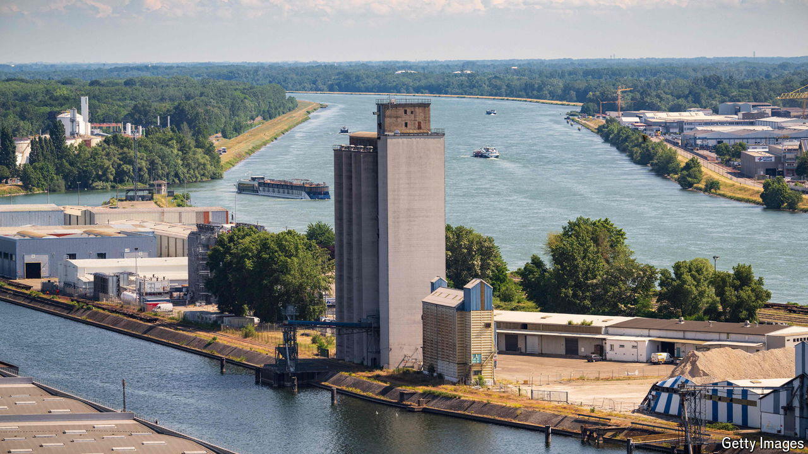

###### Peering across the Rhine

# What German business makes of France’s leftward turn 

##### Deutschland AG and France SA are closer than ever 

 

> Jul 11th 2024 

GERMAN POLITICS is followed closely in Paris. So is French politics in Berlin. Olaf Scholz, the German chancellor, said on July 8th that he was “relieved” that the far right failed to win the French parliamentary election on July 7th. What Mr Scholz did not mention were worries in German companies about what the New Popular Front (NFP), the leftist alliance which won the most votes and includes a hard-left element led by a former Trotskyist, have in store for business. 

What happens to French business matters to Germans because ties between Deutschland AG and France SA are closer than ever. Germany is France’s biggest export market and its biggest trading partner. France is likewise among the largest recipients of German goods and services. Businesses in each country invest a lot across the Rhine. Airbus, a Franco-German planemaking Goliath worth over €100bn ($108bn), is among Europe’s most valuable companies. Siemens, a German engineering conglomerate, and Alstom, a French one, were blocked by EU trustbusters from creating an Airbus for trains but still plan to build locomotives together. 

Other cross-border ventures are proliferating. Siemens Energy, which was spun off from Siemens and makes power equipment, and Air Liquide, a French purveyor of industrial gases, are co-operating to manufacture large-scale electrolysers to produce hydrogen, a promising clean store of energy. French and German armsmakers are in talks about the joint production of a combat tank.

