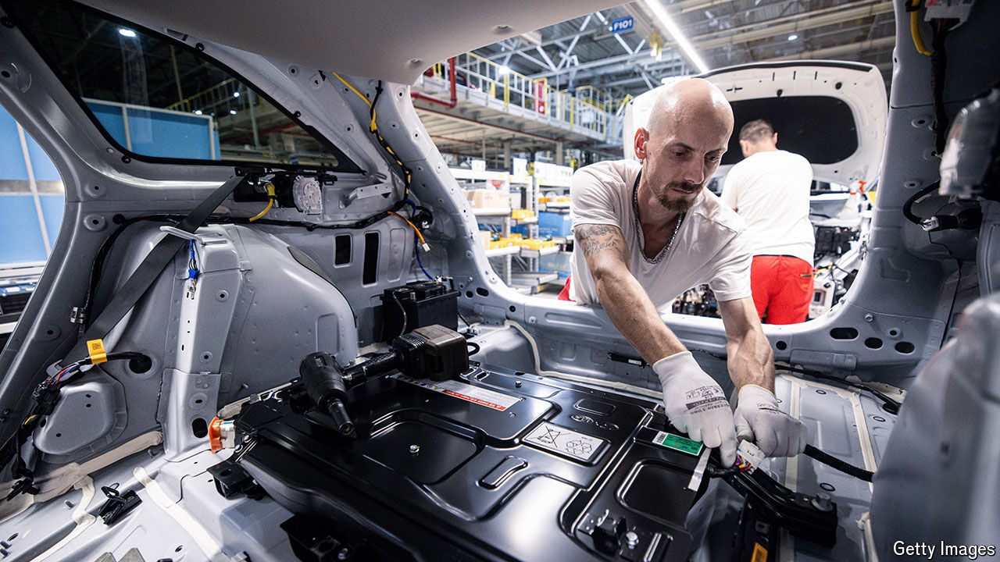

###### Power drain

# Why most battery-makers struggle to make money 

##### This is not your classic boom-and-bust cycle 

 

> Jul 11th 2024 

Boom-and-bust cycles all tend to look the same. A consumer fad or industrial urgency fuels demand for a product. Prices rise. Producers invest in capacity. By the time new supply materialises it outstrips already sated demand. Prices crash. Then, at some point, things get so cheap as to set off another demand upswing. And so on. 

