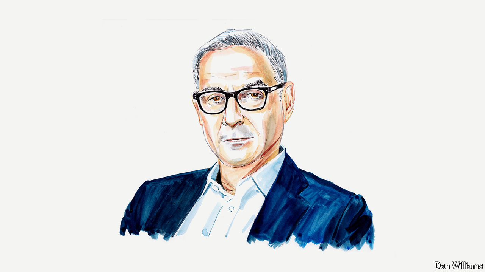

###### The American election

# A big donor says Joe Biden’s team has gone all Trumpian 

##### The president is deluding himself. Democrats are better than that, says Ari Emanuel 

 

> Jul 8th 2024 

STOP ME IF this sounds familiar. A president warns of an existential threat and says he alone can fix it. His advisers blithely deny facts that everyone can see with their own eyes and cover up health scares. His supporters reject all criticism and instead demand his opponents be imprisoned.

I’m not talking about Donald Trump. After a catastrophic debate, Joe Biden and his team are in danger of emulating the very movement they oppose. 

If Mr Biden is right to say there’s nothing more important than stopping Mr Trump from returning to the White House, then he’s wrong when he says the best—or only—way to do that is by keeping his own name on the ballot. The idea that Mr Biden “alone can fix it” is a self-aggrandising delusion on a Trumpian scale. No wonder the audience at the president’s post-debate rally sounded just like a MAGA crowd from 2016. “Lock him up!” they chanted. It was a true through-the-looking-glass moment.

