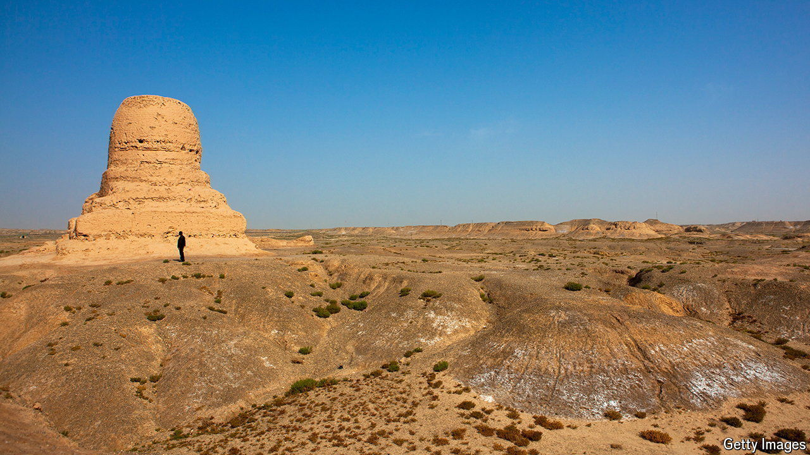

###### Artefacts that serve a purpose

# China is using archaeology as a weapon 

##### The state is unearthing ancient justifications for its rule over Xinjiang 

 

> Jul 11th 2024 

In the desert outside Kashgar, an oasis city in the far-western region of Xinjiang, an ancient Buddhist stupa rises out of the sand. Because of its conical shape, it is known as Mo’er, the word for “chimney” in the language of the native Uyghurs. The stupa and a temple next to it were probably built some 1,700 years ago and abandoned a few centuries later. Chinese archaeologists started excavating the site in 2019. They have dug up stone tools, copper coins and fragments of a Buddha statue. 

