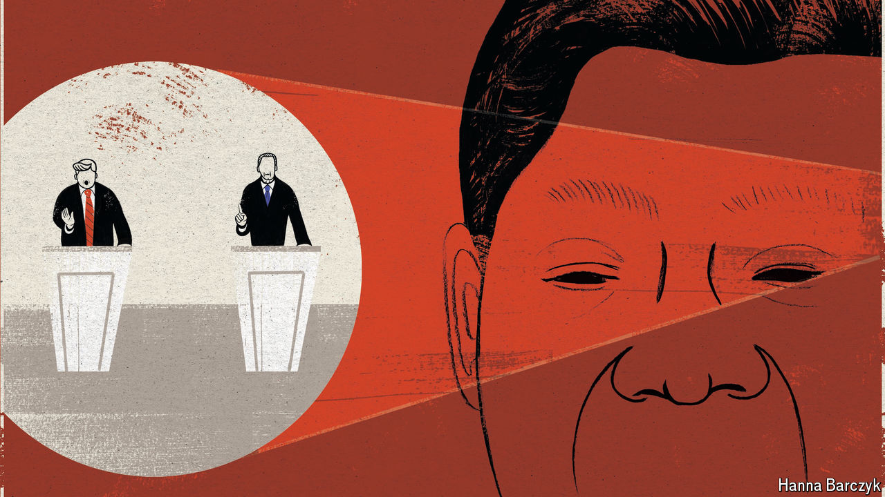

###### Under Xi’s gaze

# China views America’s presidential nightmare with mirth—and disquiet 

##### Some Chinese are rooting for Gavin Newsom to become the Democratic candidate 

 

> Jul 11th 2024 

Chinese officials scorn President Joe Biden’s view that the world is engaged in a “battle between democracy and autocracy”. In their view this is dangerous cold-war talk. But they are tough fighters themselves, ever keen to sow misgivings at home and abroad about Western democracy’s failings. The weaknesses revealed by America’s presidential contest and, in particular, the debate between Mr Biden and Donald Trump on June 27th may help their case. The Communist Party’s , though, is mixed with apprehension. 

Unlike Russia’s president, Vladimir Putin, who was said to be asleep during the encounter (it began at 4am in Moscow), China’s leader, Xi Jinping, was about to deliver a speech on Chinese diplomacy in Beijing (it was 9am there) as the debate began. He was in full flow—reading confidently from a script—as the befuddled American president struggled against his waffling, truth-dodging rival. Mr Xi did not mention America, let alone the debate, but took a swipe at American anxiety about China’s rise. “Every increase of China’s strength is an increase of the prospects of ,” he said. 

Chinese netizens were quick to heap scorn on the Biden-Trump encounter. Clips showing Mr Biden’s confused and fumbling remarks circulated widely on China’s social media. “One is a ‘mentally deranged felon’ and the other is an ‘elderly narcoleptic’,” said one commenter on Weibo, an X-like platform. “Two people who are about to enter their coffins are fighting back and forth,” said another. “Western politics is truly ruptured. There’s no one left.” Posts on Weibo with tags relating to the debate gained well over 100m views and attracted thousands of comments. 

