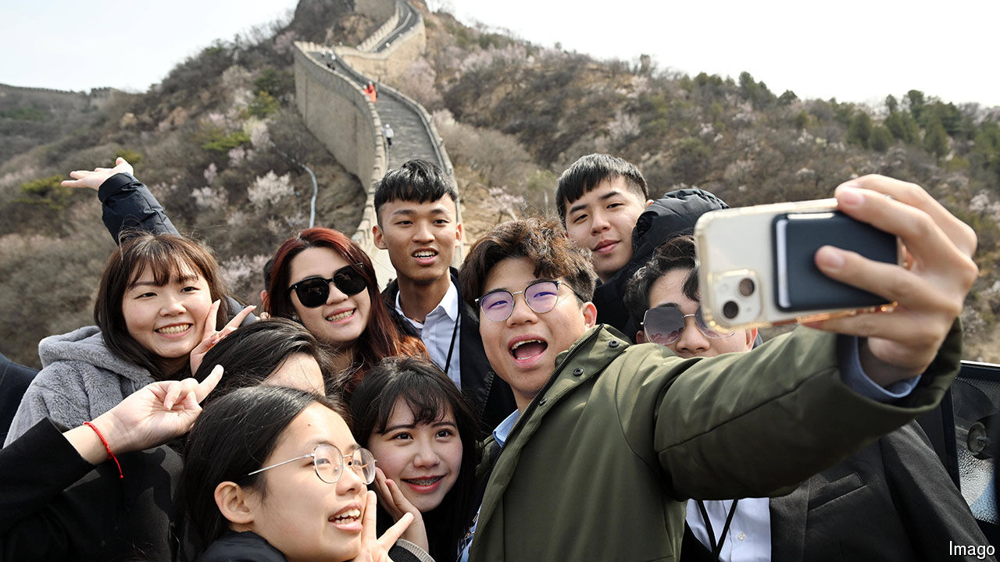

###### United Front summer camp

# Songs, pandas and praise for Xi: how China courts young Taiwanese 

##### Come for the hot pot, endure the propaganda 

 

> Jul 11th 2024 

HENRY WANG enjoyed his recent trip to the province of Sichuan. The 22-year-old was in China to attend a camp for young Taiwanese. He spent seven nights in four-star hotels, feasting on hot pot, viewing pandas and visiting historic sites. The Chinese government paid for most of it. The only annoying part was the political indoctrination. He tolerated yammering about cross-strait unity, praise for China’s leader, Xi Jinping, and songs about being one family. “I thought of it as the extra cost I had to pay for a cheap trip,” he says. As long as you know you are on a “United Front tour”, you can ignore the propaganda, he adds, referring to the branch of the Communist Party in charge of boosting its influence among Chinese abroad.

